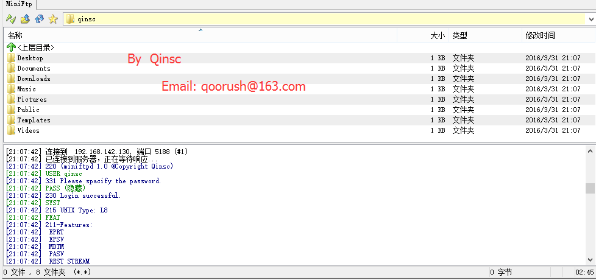

# MiniFtp

[MiniFtp v1.0](https://github.com/skyqinsc/MiniFtp/) Copyright © Qinsc

## Qinsc's ftpserver

* This is a simple ftpserver. 
* Created September 2015 by Shuchang Qin 
* From : Wuhan University of Science and Technology ,Network Engineering
* E-mail: skyqinsc@gmail.com
* Repo URL: https://github.com/skyqinsc/MiniFtp

MiniFtp服务器：

介绍：本服务器，实现FTP基本命令，主被动传输模式。

技术：作为一个并发服务器模型，涉及多进程协作，进程通信，I/O复用模型，网络编程相关技术；

功能实现：
* 主被动传输模式
* FTP基本命令
* 上传与下载，断点续传
* 上传/下载限速
* 连接数限制

* * *

**(此Repo仅作个人项目，如需fork，请注明出处)**

* * *

*LeapFTP3.01成功连接MiniFtp服务器截图:*

*MiniFtp服务器后台日志截图:*

By Qinsc
